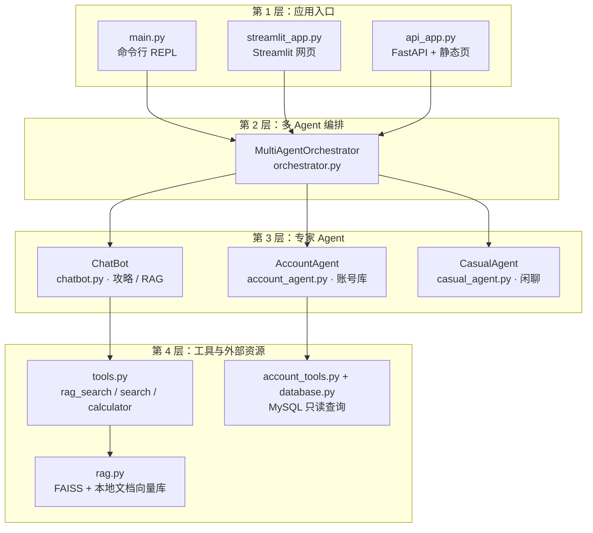
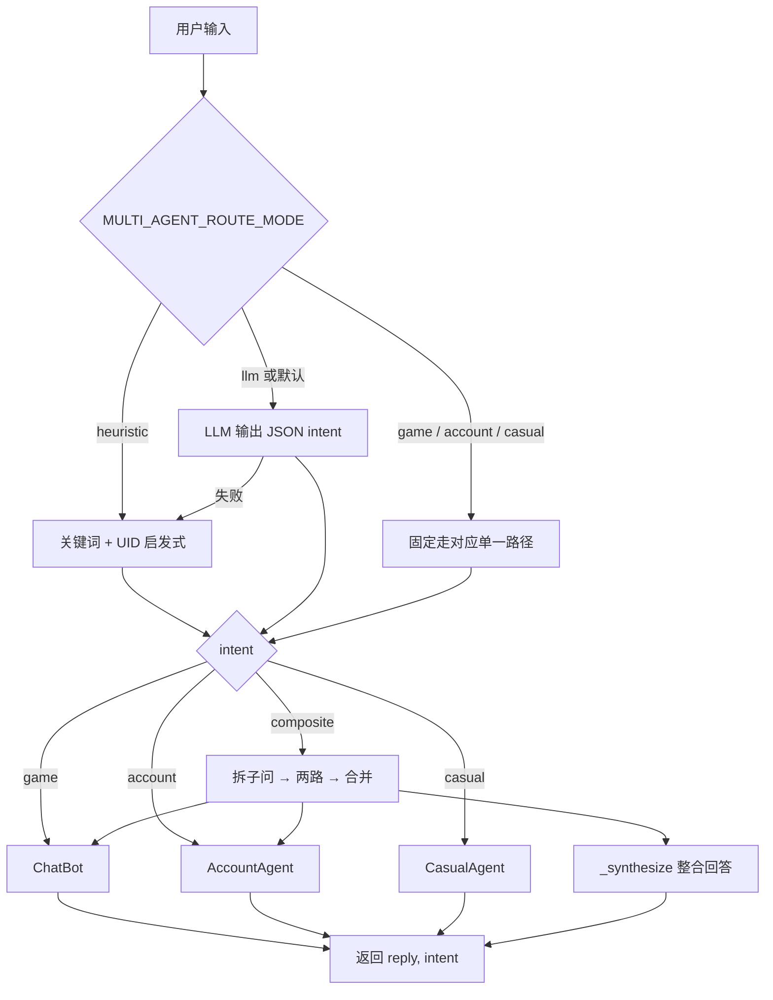
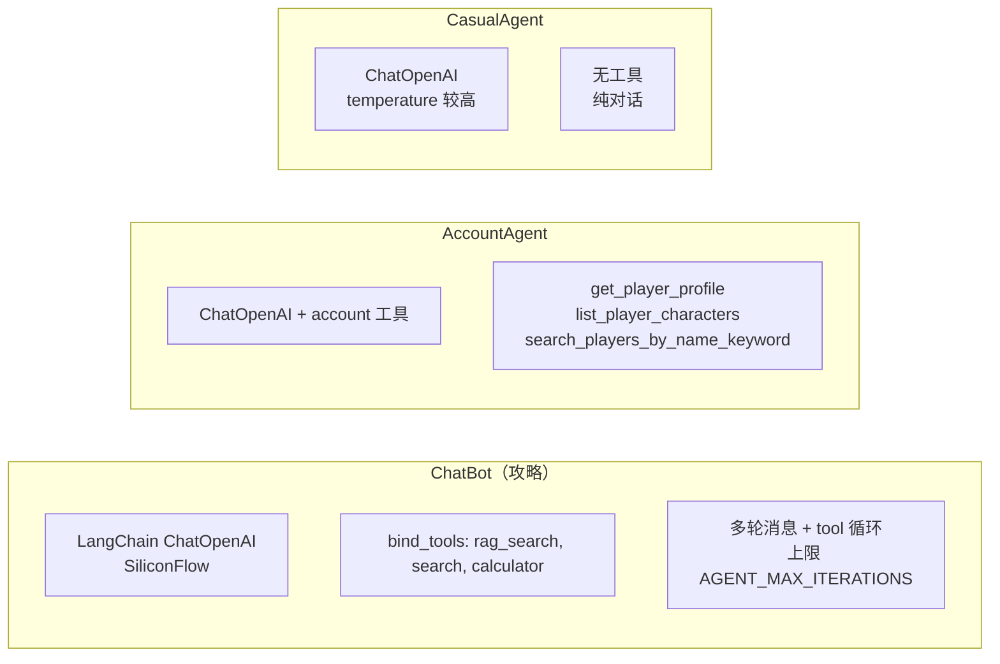
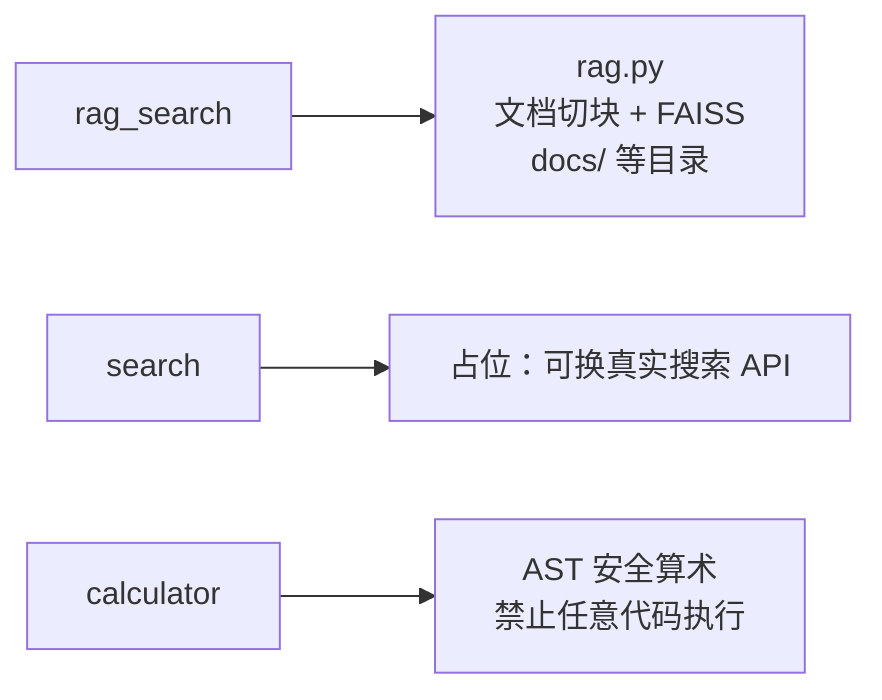
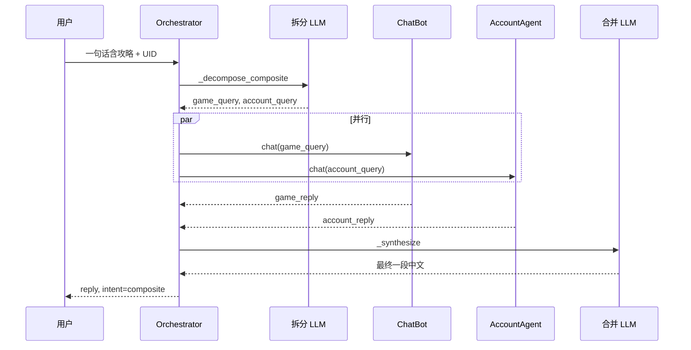

# 多 Agent 项目：流程与结构（分层说明）

本文用「入口层 → 编排层 → 专家 Agent → 工具/数据层」由上至下说明；图形使用 Mermaid，在支持 Mermaid 的编辑器或 Git 平台中可正常渲染。

---

## 1. 总览：系统分层

**职责摘要**

| 层 | 作用 |
|----|------|
| 第 1 层 | 三种不同 UI/协议，都调用同一套 `MultiAgentOrchestrator.chat()`。 |
| 第 2 层 | 意图路由；复合问题拆子问、多路执行、再合并。 |
| 第 3 层 | 三个「专家」：攻略带工具循环、账号带 MySQL 工具、闲聊无业务工具。 |
| 第 4 层 | 具体能力：向量检索、安全计算、泛化搜索占位、只读 SQL。 |

---

## 2. 第 1 层：入口方式

| 文件 | 启动方式 | 行为 |
|------|----------|------|
| `main.py` | `python main.py` | 循环 `input()`，打印 `AI（路由名）：回复`。 |
| `streamlit_app.py` | `streamlit run streamlit_app.py` | 会话内单例 `MultiAgentOrchestrator`；「新对话」调用 `clear_history()`。 |
| `api_app.py` | `uvicorn api_app:app --host 0.0.0.0 --port 8000` | `session_id` 映射到独立编排器；`GET /` 提供 `static/index.html`。 |

环境变量：至少需 `MODEL_NAME`、`SILICONFLOW_API_KEY`；MySQL 与 RAG 相关见 `.env.example`。

---

## 3. 第 2 层：编排器 `MultiAgentOrchestrator`

### 3.1 路由流程

- **game**：原神攻略、深渊、配队、机制等（原 `ChatBot` 能力）。
- **account**：查 UID、树脂、角色列表、MySQL 等（需强信号，避免把纯攻略问误判为账号）。
- **casual**：寒暄、与游戏/库无关的闲聊。
- **composite**：同一句里既要攻略又要查某 UID 数据；先 `_decompose_composite` 拆成 `game_query` / `account_query`，两路跑完后 `_synthesize` 合并。

### 3.2 路由模式（环境变量）

- `MULTI_AGENT_ROUTE_MODE`：`llm`（默认）、`heuristic`、`game`、`account`、`casual`。

---

## 4. 第 3 层：三个专家 Agent

### 4.1 对比

| Agent | 文件 | 工具 | 典型用途 |
|-------|------|------|----------|
| 攻略 | `chatbot.py` | `tools.py` → RAG / 搜索占位 / 计算器 | 深渊、boss、配队、期望伤害算术 |
| 账号 | `account_agent.py` | `account_tools.py` | 按 UID 查玩家与角色表 |
| 闲聊 | `casual_agent.py` | 无 | 日常对话，不冒充攻略或数据库 |

---

## 5. 第 4 层：工具与数据

### 5.1 攻略侧 `tools.py`

- `rag_search` 首次调用时懒加载 `RAG()`；知识库文件变更会通过指纹触发重建索引（见 `rag.py` 注释）。

### 5.2 账号侧 `account_tools.py` + `database.py`

- `fetch_all` 只读查询；表名/列名经 `_safe_ident` 限制，防 SQL 标识符注入。
- 表名等可通过环境变量覆盖（如 `MYSQL_TABLE_PLAYERS`），默认对齐 `mysql_schema.sql` 中的 `users` / `characters` 思路。

---

## 6. 复合问题（composite）数据流

若拆分失败，编排器有 `_fallback_decompose`（正则抽 UID 等）作为回退。

---

## 7. 相关文件索引（非入口）

| 文件 | 说明 |
|------|------|
| `chatbot_test.py` | 测试/调试用 |
| `mysql_schema.sql` | 示例库表结构 |
| `docs/*.txt` | RAG 可索引的文本来源之一（具体路径见 `rag.py` 中数据目录配置） |
| `static/index.html` | API 模式下的前端页面 |

---

## 8. 小结

- **唯一业务编排中心**是 `orchestrator.py` 中的 `MultiAgentOrchestrator`；三种入口只是「如何收集用户输入、如何展示结果」的差异。
- **意图**决定走单一专家还是 **composite** 双路 + 合并。
- **攻略**依赖 **向量知识库 + 可选工具循环**；**账号**依赖 **MySQL 只读**；**闲聊**无工具，避免编造专业数据。
